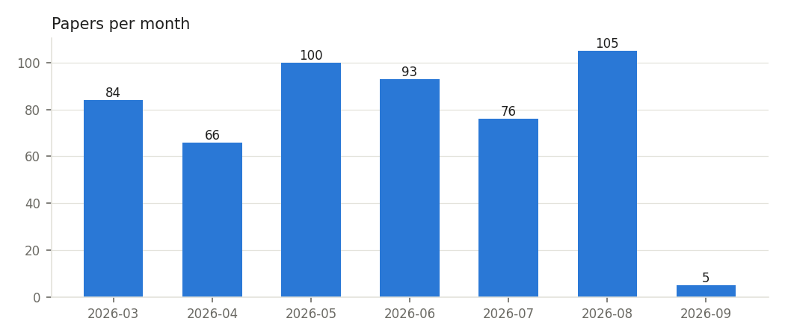
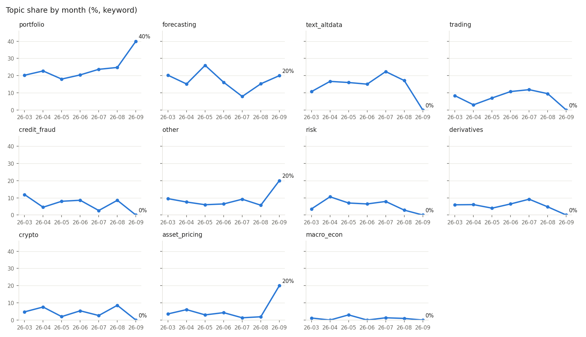
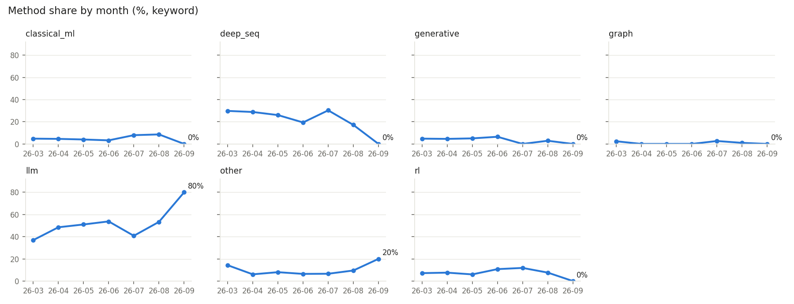

# 금융 머신러닝 (Financial Machine Learning) 연구 동향 보고서

- 생성: 2026-09-25 22:03 · 분류 방식: **keyword**
- 데이터: arXiv API, 2026-03 ~ 2026-09 (7개월), 논문 529건
- 월별 비중은 LLM 이 아니라 코드로 계산 (해당 월 논문 수 대비 비율)

## 1. 월별 논문 수

## 2. 주제별 월별 비중

| 주제 | 논문 수 | 전체 비중 | 26-03 | 26-04 | 26-05 | 26-06 | 26-07 | 26-08 | 26-09 | 전반→후반 (%p) |
|---|---:|---:|---:|---:|---:|---:|---:|---:|---:|---:|
| 포트폴리오·자산배분 | 115 | 21.7% | 20% | 23% | 18% | 20% | 24% | 25% | 40% | +3.3 |
| 수익률·가격 예측 | 91 | 17.2% | 20% | 15% | 26% | 16% | 8% | 15% | 20% | -7.6 |
| 금융 텍스트·감성·대체데이터 | 85 | 16.1% | 11% | 17% | 16% | 15% | 22% | 17% | 0% | +3.2 |
| 트레이딩·시장 미시구조 | 45 | 8.5% | 8% | 3% | 7% | 11% | 12% | 10% | 0% | +4.0 |
| 신용·사기탐지·은행 | 40 | 7.6% | 12% | 5% | 8% | 9% | 3% | 9% | 0% | -1.6 |
| 기타 | 39 | 7.4% | 10% | 8% | 6% | 6% | 9% | 6% | 20% | -0.4 |
| 리스크·변동성 | 32 | 6.0% | 4% | 11% | 7% | 6% | 8% | 3% | 0% | -1.4 |
| 파생상품 가격결정·헤징 | 31 | 5.9% | 6% | 6% | 4% | 6% | 9% | 5% | 0% | +1.3 |
| 암호화폐·DeFi | 27 | 5.1% | 5% | 8% | 2% | 5% | 3% | 9% | 0% | +1.3 |
| 자산가격결정·팩터 | 18 | 3.4% | 4% | 6% | 3% | 4% | 1% | 2% | 20% | -1.1 |
| 거시경제·정책 | 6 | 1.1% | 1% | 0% | 3% | 0% | 1% | 1% | 0% | -0.9 |

> ⚠️ 논문이 30건 미만인 달은 비중이 크게 흔들리므로 해석에 주의: 2026-09 (5건)

## 3. 증가·감소 주제

**증가**: 트레이딩·시장 미시구조 (+4.0%p, 기울기 -0.26%p/월), 포트폴리오·자산배분 (+3.3%p, 기울기 +2.47%p/월), 금융 텍스트·감성·대체데이터 (+3.2%p, 기울기 -0.89%p/월)

**감소**: 수익률·가격 예측 (-7.6%p, 기울기 -0.67%p/월), 신용·사기탐지·은행 (-1.6%p, 기울기 -1.18%p/월), 리스크·변동성 (-1.4%p, 기울기 -0.90%p/월)

## 4. 주제별 요약과 근거 논문

### 포트폴리오·자산배분 (115건)

근거 논문:
- (2026-08) [Super Library Agent: Joint Generation and Maintenance of Multiple Applications Beyond the Single Codebase](http://arxiv.org/abs/2608.29310v1)
- (2026-09) [FinRankGRPO: Optimizing LLMs for Listwise Financial Asset Ranking via Group Relative Policy Optimization](http://arxiv.org/abs/2609.24175v1)
- (2026-09) [Propose, Don't Judge: An Anytime-Valid Referee for LLM Agents That Mine Investment Factors](http://arxiv.org/abs/2609.27051v1)

### 수익률·가격 예측 (91건)

근거 논문:
- (2026-08) [(Mis)Understanding Benign Overfitting in Equity Return Prediction](http://arxiv.org/abs/2608.23761v1)
- (2026-08) [DSA: Evidence-Aware LLM-Agent Orchestration for Multi-Market Stock Research](http://arxiv.org/abs/2608.26990v1)
- (2026-09) [The Informational Content in Lepto-Variance and Its Relation to Higher Moments](http://arxiv.org/abs/2609.25144v1)

### 금융 텍스트·감성·대체데이터 (85건)

근거 논문:
- (2026-08) [Converting Expert Deliberation into Financial Signals Through A Context-Aware NLP Pipeline](http://arxiv.org/abs/2608.18911v1)
- (2026-08) [Automated Summarization of Financial News Using Large Language Models and Retrieval-Augmented Generation: An Early Empirical Study (Fall 2023)](http://arxiv.org/abs/2608.19526v1)
- (2026-08) [Frontiers in FinTech: Multimodal Foundation Models for Financial Reporting and Decision Science](http://arxiv.org/abs/2608.22724v2)

### 트레이딩·시장 미시구조 (45건)

근거 논문:
- (2026-08) [Tabular Deep Learning for Algorithmic Trading: Cross-Regime Bayesian Optimisation for Equity Signal Generation](http://arxiv.org/abs/2608.27076v1)
- (2026-08) [What survives honest evaluation? Leakage-safe, search-aware assessment of LLM-driven trading strategy discovery](http://arxiv.org/abs/2608.27734v1)
- (2026-08) [RetailAgent: Structured Adverse Timing in Self-Conditioned Multimodal LLM Trading Agents](http://arxiv.org/abs/2608.28399v1)

### 신용·사기탐지·은행 (40건)

근거 논문:
- (2026-08) [DTD-VAE: Disentangled Temporal Dependencies VAE for Credit Risk Prediction](http://arxiv.org/abs/2608.26473v2)
- (2026-08) [A Temporal Multiplex Graph Neural Network for Systemic Risk Transmission in Global Banking](http://arxiv.org/abs/2608.27295v1)
- (2026-08) [Oculi: A Conversational Agentic Platform for Automated Credit Risk Analysis](http://arxiv.org/abs/2608.28944v1)

### 기타 (39건)

근거 논문:
- (2026-08) [Spatially explicit feature importance for building height estimation using research-access high-resolution SAR and optical sensors](http://arxiv.org/abs/2608.17822v1)
- (2026-08) [PGFS++: Molecular Property Improvement under Synthesis and Diversity Constraints](http://arxiv.org/abs/2608.19121v1)
- (2026-09) [Bridging LLM Serving and CXL-SSDs with Chunk-Aware KV Cache Management](http://arxiv.org/abs/2609.26828v1)

### 리스크·변동성 (32건)

근거 논문:
- (2026-08) [Neural Networks with Local Converging Inputs for Efficient Options Pricing Models](http://arxiv.org/abs/2608.02778v1)
- (2026-08) [Beyond Forecasting: Recasting Volatility Control as a Routing Problem](http://arxiv.org/abs/2608.10375v1)
- (2026-08) [Asymptotically-informed neural networks for Black-Scholes implied volatility computation](http://arxiv.org/abs/2609.05491v1)

### 파생상품 가격결정·헤징 (31건)

근거 논문:
- (2026-08) [Your AI, On a Dial: Controlling Investment Bias in LLMs with a Single Neuron](http://arxiv.org/abs/2608.22852v1)
- (2026-08) [Deep Hedging Under Realistic Market Frictions: A Regime-Conditional Empirical Study of Dynamic Option Hedging on Bitcoin Options](http://arxiv.org/abs/2608.29025v1)
- (2026-08) [Neural Calibration of a Complete Market Model](http://arxiv.org/abs/2608.30867v1)

### 암호화폐·DeFi (27건)

근거 논문:
- (2026-08) [FlowShield: cryptocurrency anti-money laundering with transaction semantics parsing and fund flow tracking](http://arxiv.org/abs/2608.17355v1)
- (2026-08) [Quality over Quantity: Semi-Supervised Detection of Illicit Bitcoin Flows via Feature Engineering](http://arxiv.org/abs/2609.27936v1)
- (2026-08) [An Open-Source, Event-Driven Pipeline for Cryptocurrency Market Data: Ingestion, Forecasting, and On-Chain Fraud Detection](http://arxiv.org/abs/2608.29973v1)

### 자산가격결정·팩터 (18건)

근거 논문:
- (2026-08) [Cross-Sectional Heterogeneity in LSTM Networks for Financial Time Series](http://arxiv.org/abs/2608.05755v2)
- (2026-08) [AlphaSeek: Trajectory-Level Self-Iterative Factor Mining Framework for Multi-Source Financial Data](http://arxiv.org/abs/2608.13913v1)
- (2026-09) [AlphaDiverse: Post-Training Local Quantitative Research Agents for Diverse Exploration in Alpha Factor Mining](http://arxiv.org/abs/2609.29014v1)

### 거시경제·정책 (6건)

근거 논문:
- (2026-05) [Deep Least Squares Monte Carlo methods for the valuation of variable annuities with guarantees](http://arxiv.org/abs/2605.27182v1)
- (2026-07) [Augmenting Fundamental Analysis with Large Language Models: A RAG-Based System for Generating Investor Briefs](http://arxiv.org/abs/2607.09121v1)
- (2026-08) [Can LLMs Take the Pulse of the Economy? A Real-Time Evaluation of LLM Nowcasts on Macroeconomic Indicators](http://arxiv.org/abs/2608.30110v1)

## 5. 방법론 비중 (보조)

| 방법론 | 26-03 | 26-04 | 26-05 | 26-06 | 26-07 | 26-08 | 26-09 |
|---|---:|---:|---:|---:|---:|---:|---:|
| 전통 ML(트리·선형·SVM) | 5% | 5% | 4% | 3% | 8% | 9% | 0% |
| 딥러닝 시계열(Transformer·RNN 등) | 30% | 29% | 26% | 19% | 30% | 17% | 0% |
| 생성모델(Diffusion·GAN·VAE) | 5% | 5% | 5% | 6% | 0% | 3% | 0% |
| 그래프 신경망 | 2% | 0% | 0% | 0% | 3% | 1% | 0% |
| LLM·생성형 에이전트 | 37% | 48% | 51% | 54% | 41% | 53% | 80% |
| 기타/통계·이론 | 14% | 6% | 8% | 6% | 7% | 10% | 20% |
| 강화학습 | 7% | 8% | 6% | 11% | 12% | 8% | 0% |
