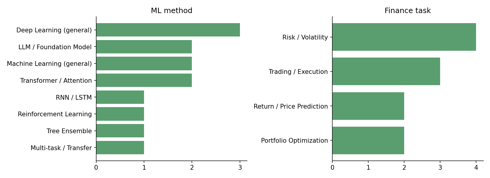
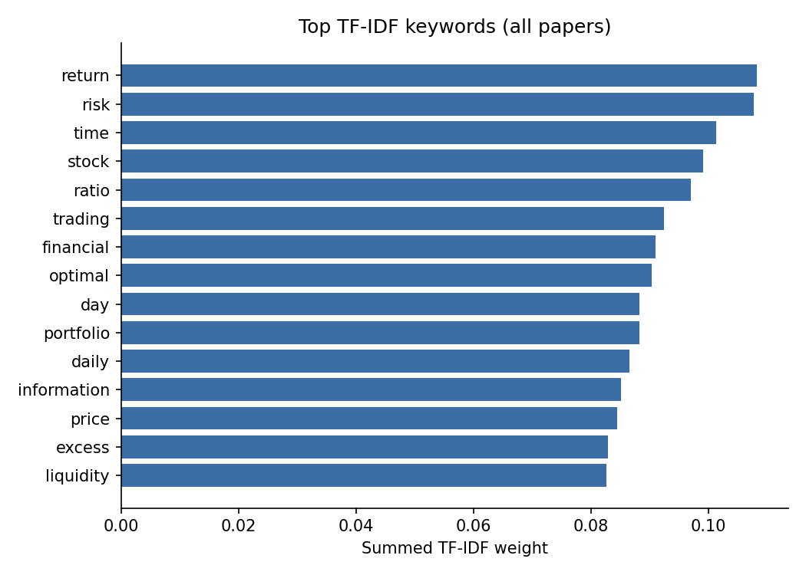
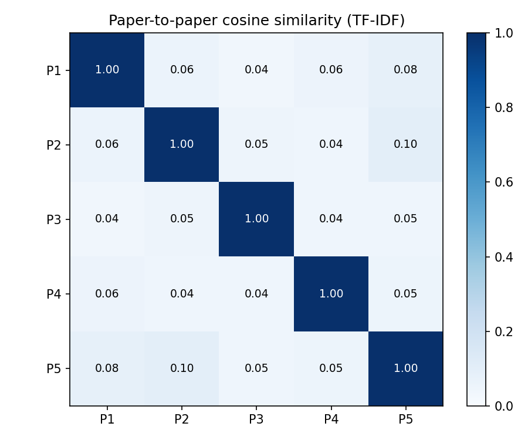

# 금융 머신러닝 최신 논문 자동 분석 리포트

- 생성 시각: 2026-09-24 15:04
- 논문 수: 5편 (출처: arxiv) · PDF 본문 분석 5편
- 전체 상위 키워드: return, risk, time, stock, ratio, trading, financial, optimal, day, portfolio

## 1. 논문 목록

| # | 제목 | 게재일 | 쪽수 | ML 방법론 | 금융 과제 |
|---|---|---|---|---|---|
| P1 | [Propose, Don't Judge: An Anytime-Valid Referee for LLM Agents That Mine Investment Factors](http://arxiv.org/abs/2609.27051v1) · [PDF](../data/pdfs/2609.27051v1.pdf) | 2026-09-22 | 37 | LLM / Foundation Model; Reinforcement Learning | Trading / Execution; Risk / Volatility |
| P2 | [Hierarchical Multi-Task Learning with Liquidity-Aware Signals for Stock Forecasting](http://arxiv.org/abs/2609.25617v1) · [PDF](../data/pdfs/2609.25617v1.pdf) | 2026-09-22 | 9 | Transformer / Attention; RNN / LSTM; Tree Ensemble; Deep Learning (general); Multi-task / Transfer | Return / Price Prediction; Portfolio Optimization; Trading / Execution; Risk / Volatility |
| P3 | [The Informational Content in Lepto-Variance and Its Relation to Higher Moments](http://arxiv.org/abs/2609.25144v1) · [PDF](../data/pdfs/2609.25144v1.pdf) | 2026-09-21 | 16 | Machine Learning (general) | Risk / Volatility |
| P4 | [Risk Measures under Paired-Ambiguity: A Deep Learning Reflected BSDE Framework](http://arxiv.org/abs/2609.23768v1) · [PDF](../data/pdfs/2609.23768v1.pdf) | 2026-09-20 | 31 | Deep Learning (general) | Risk / Volatility |
| P5 | [Financial Language Models as Applied Artificial Intelligence Systems for News-Based Trading under Market Frictions](http://arxiv.org/abs/2609.23703v1) · [PDF](../data/pdfs/2609.23703v1.pdf) | 2026-09-20 | 47 | LLM / Foundation Model; Transformer / Attention; Deep Learning (general); Machine Learning (general) | Return / Price Prediction; Portfolio Optimization; Trading / Execution |

## 2. 논문별 분석

### P1. Propose, Don't Judge: An Anytime-Valid Referee for LLM Agents That Mine Investment Factors

- **저자**: Bo Qu, Mingguang Chen, Licheng Wang
- **게재**: arXiv (2026-09-22)
- **분량**: 37쪽 · 본문 11,983단어 · 그림 7개 · 표 18개
- **섹션 구성**: abstract, introduction, related_work, method, results, conclusion, data
- **ML 방법론**: LLM / Foundation Model; Reinforcement Learning
- **금융 과제**: Trading / Execution; Risk / Volatility
- **데이터 유형**: Fundamental / Accounting
- **사용 데이터셋·시장 (언급 횟수)**: CSI 500(6)
- **평가지표 (언급 횟수)**: IC / Rank IC(32); Sharpe ratio(19); Turnover(5); Accuracy(2)
- **핵심 키워드**: referee, frozen, edge, agent, false, controller, bandit, book, frozen referee, admitted
- **초록 요약**: The certificate's price is time: an admitted true factor waits about 500 trading days, and the certified portfolio's Sharpe ratio therefore trails an ungated one. Judging belongs to the procedure; proposing and instrument-making belong to the agent.
- **결론 요약**: The wait scales like ln(Nv/(kα)) · 2σ2/µ2. The marginal-null guarantee under autocorrelation is measured, not proved. Its guarantee concerns the average run length.

### P2. Hierarchical Multi-Task Learning with Liquidity-Aware Signals for Stock Forecasting

- **저자**: Hengyi Yang, Sida Lin, Yiyan Qi, Yankai Chen, Haohan Zhang, Xianhua Peng, Jian Guo
- **게재**: arXiv (2026-09-22)
- **분량**: 9쪽 · 본문 5,310단어 · 그림 5개 · 표 0개
- **섹션 구성**: introduction, method, results, conclusion
- **ML 방법론**: Transformer / Attention; RNN / LSTM; Tree Ensemble; Deep Learning (general); Multi-task / Transfer
- **금융 과제**: Return / Price Prediction; Portfolio Optimization; Trading / Execution; Risk / Volatility
- **데이터 유형**: Time Series
- **사용 데이터셋·시장 (언급 횟수)**: CSI 300(16); CSI 500(10)
- **평가지표 (언급 횟수)**: IC / Rank IC(11); Annualized return(9); Turnover(8); Sharpe ratio(7); RMSE / MSE(3); Accuracy(3); Sortino(2)
- **핵심 키워드**: apo, auxiliary, limt, cross-stock, ldl, module, temporal, multi-task, cross-task, volume
- **초록 요약**: Building on this latent state, we introduce a Liquidity-Driven Learning (LDL) module, a mixture-of-experts architecture that features cross-task gating mechanisms to jointly predict price movement, volatility, and trading volume. In realistic CSI300 backtests, APO improves annualized return from 3.99% to 10.01% and Sharpe ratio from 1.22 to 1.86 over equal weighting, showing that the multi-task forecasts translate into deployable portfolio gains.
- **결론 요약**: We presented LiMT, a hierarchical multi-task framework for stock forecasting and liquidity-aware portfolio construction. LiMT combines alternating cross-stock/temporal attention, cross-task expert routing, and a lightweight APO rule. (30) Rank-based (linear normalization): let ρi,t = RankGt(si,t).

### P3. The Informational Content in Lepto-Variance and Its Relation to Higher Moments

- **저자**: Vassilis Polimenis
- **게재**: arXiv (2026-09-21)
- **분량**: 16쪽 · 본문 6,036단어 · 그림 5개 · 표 4개
- **섹션 구성**: abstract, conclusion
- **ML 방법론**: Machine Learning (general)
- **금융 과제**: Risk / Volatility
- **데이터 유형**: Synthetic / Simulation; Fundamental / Accounting
- **사용 데이터셋·시장 (언급 횟수)**: Fama-French(2)
- **평가지표 (언급 횟수)**: VaR / ES(28); RMSE / MSE(24); R²(3)
- **핵심 키워드**: lepto-variance, bit, lepto-ratio, variance, lepto, sample variance, polimenis, variability, kyrt, total variance
- **초록 요약**: It is a novel, model-free method potentially revealing information on important sample structure properties. Both lepto-variance and lepto-ratio are orthogonal to sample skew.
- **결론 요약**: The lepto-variance and lepto-regression are novel non-parametric statistical concepts introduced in Polimenis (2022) and (2024). Both lepto-variance and lepto-ratio are orthogonal to sample skew. While lepto-ratio is strongly correlated to lepto-variance it remains orthogonal to sample variance.

### P4. Risk Measures under Paired-Ambiguity: A Deep Learning Reflected BSDE Framework

- **저자**: Nacira Agram, Jan Rems, Emanuela Rosazza Gianin
- **게재**: arXiv (2026-09-20)
- **분량**: 31쪽 · 본문 11,424단어 · 그림 3개 · 표 5개
- **섹션 구성**: abstract, introduction
- **ML 방법론**: Deep Learning (general)
- **금융 과제**: Risk / Volatility
- **데이터 유형**: -
- **사용 데이터셋·시장 (언급 횟수)**: -
- **평가지표 (언급 횟수)**: R²(9)
- **핵심 키워드**: bsde, obstacle, driver, entropic, optimal stopping, ess, discount, quadratic, ess inf, reflected bsde
- **초록 요약**: We introduce a paired ambiguity framework combining Girsanov model uncertainty with cash subadditive risk evaluation and characterize the stopping value by an upper reflected backward stochastic differential equation (BSDE). Numerical experiments for American options illustrate the effects of discount rate and entropic ambiguity on stopping values and exercise decisions.
- **결론 요약**: -

### P5. Financial Language Models as Applied Artificial Intelligence Systems for News-Based Trading under Market Frictions

- **저자**: Kemal Kirtac
- **게재**: arXiv (2026-09-20)
- **분량**: 47쪽 · 본문 10,390단어 · 그림 1개 · 표 13개
- **섹션 구성**: abstract, introduction, related_work, data, method, results, conclusion
- **ML 방법론**: LLM / Foundation Model; Transformer / Attention; Deep Learning (general); Machine Learning (general)
- **금융 과제**: Return / Price Prediction; Portfolio Optimization; Trading / Execution
- **데이터 유형**: Time Series; Text / News / Sentiment; Fundamental / Accounting
- **사용 데이터셋·시장 (언급 횟수)**: CRSP(20); S&P 500(2); Bloomberg(2)
- **평가지표 (언급 횟수)**: Accuracy(20); Sharpe ratio(17); Turnover(6); AUC(5); F1(4)
- **핵심 키워드**: news, text, llama-, articles, replication, mfast, firm, dictionary, probabilities, operational
- **초록 요약**: Computer science research has developed strong methods for time-series forecasting, text classification, multimodal stock prediction, graph-based market modeling, and machine-learning operations, yet these streams do not provide a domain-specific protocol that jointly tests financial language-model outputs under event-time observability, probability calibration, execution timing, transaction costs, liquidity constraints, capacity limits, operational diagnostics, and statistical inference. We introduce MFAST, a Market-Friction-Aware Sentiment-to-Trading framework that converts timestamped financial text into auditable, reproducible, and market-feasible trading decisions.
- **결론 요약**: Conclusion The paper develops MFAST, a market-friction-aware sentiment-to-trading framework for evaluating financial language models as applied artificial intelligence systems. The framework treats model output as one component in a deployable pipeline that links text ingestion, firm matching, temporal discipline, sentiment inference, calibration, signal ranking, portfolio formation, transaction costs, liquidity screens, capacity constraints, factor adjustment, compu- 36 tational feasibility, public replication, and explainability. Component ablations, statistical trading tests, and public-data replication strengthen the empirical claim.

## 3. 교차 분석

- 가장 유사한 논문 쌍: **P2 ↔ P5** (코사인 유사도 0.10)
